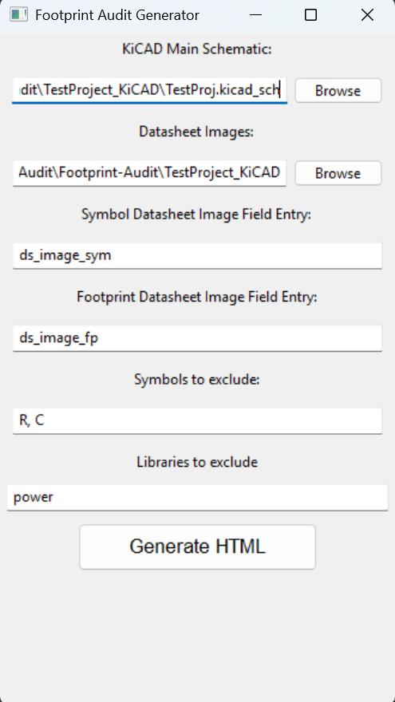
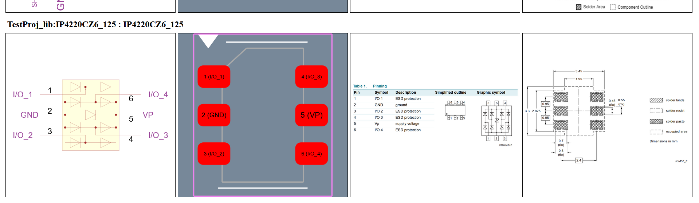

# KiCAD Footprint-Audit
An automatic KiCAD Footprint and Symbol Audit Creator

The plan for this project is to have a KiCAD Plugin that creates an interactive HTML file (maybe even having a built in measurement tool), that includes the footprint, symbol and pictures of the datasheet, for every component on the pcb, so they can be crosschecked, before sending the pcb to production. 
This should make it easier to audit the correctness of the used footprints, and make mistakes easier to spot. 
Necessary pictures from the datasheed would need to be provided manually, and linked in the KiCAD symbol with specific fields.

The HTML generation is probably going to be inspired by the [Interactive HTML BOM](https://github.com/openscopeproject/InteractiveHtmlBom/tree/master/InteractiveHtmlBom) plugin

## What's been accomplished:
A lot actually!

### TestProject_KiCAD
The TestProject_KiCAD folder is a basic KiCAD Project for debugging. 
There are some mistakes done on purpose, to check the usefulness of the tool. 
in TestProject_KiCAD/FP_Audit, there is also the generated HTML file of this project (excluded R, C and the library 'power')  

### Footprint_Audit
This is where the source code for the plugin lays. 
The main entry point for the gui is: standalone_gui_start.py 
gui_main.py is the generated GUI using wxFormBuilder
and footprint_audit.py is the starting point for the KiCAD File Parser and HTML file generator 

footprint_audit.py can also be run by it's own, but the arguments are hardcoded for now (maybe I'm adding a CLI interface in the future)

### pyInstaller_Build
I've prebuilt a one-file executable on Windows using pyInstaller. 
I simply wrote the command: 
<code>pyInstaller --onefile --name Footprint-Audit --add-data  "../Footprint_Audit/web/fp_audit_style.css;web" --add-data  "../Footprint_Audit/web/fp_audit.js;web" --add-data  "../Footprint_Audit/web/fp_audit.html;web" --add-data  "../Footprint_Audit/web/Konva_min.js;web" ../Footprint_Audit/standalone_gui_start.py</code> 
inside the pyInstaller_Build folder, to generate it. 

It is important to use <code>--add-data</code>, because the executable will be launched inside a temp folder. The distinction between running footprint_audit.py as script or executable is also baked into generate_html.py to generate the correct path. 

On Linux the pyInstaller command should use <code>:</code> instead of <code>;</code>, but I've not tried it yet.  

The Program does need some pip plugins like wx, sexp, ... that can be installed using <code>pip install</code> 

## How to use

For now I've only implemented a standalone GUI. 
The usage is pretty straight-forward:  
   
The first field is the path to the main schematic (named after the project itself), all hierarchical schematics will be parsed automatically. 
The second field, is the path to where the datasheet images are saved.
BE AWARE: This path will be combined with the path of the field entries in the KiCAD symbol. 

If you'll look into the KiCAD symbols, you'll see these field entries:
 
because I used a relative path inside these two fields, the folder to select in the generator needs to be the Project Root folder! 
It could also be used like this: 
 
, then the folder specified should be 'Models/fp_audit_pics'  

The third and fourth fields in the generator, are what the image fields are called, ds_image_... is the standard setting. 
The last two fields are optional and lets you exclude certain symbols and libraries. 
I set the standard to exclude all Resistors and Capacitors (Symbols called R or C), and the whole 'power' library, as these symbols do not have footprints anyway! 
All of those entries need to be comma-separated, whitespaces will be automatically stripped. 

After hitting 'Generate HTML', the finished html file will be save at /FP_Audit/fp_audit.html, inside the KiCAD Project folder. 

 
All symbols and footprints can be moved with a button press and zoomed with the scrollwheel or touchpad. 
The footprint canvas also allows to make measurements, with a doubleclick:
 
The measurement has a snap-in function on rectangles, lines, and circles, to allow more accurate measurements to be made! 

Thanks for reading all that ^^ 

Feel free to look through the source, but be aware that this is my first bigger Python/JS project, therefore the code might be awful to look at :P (learned alot tho)

## What's next
If I've got the time, I would like to tidy up the python code a bit! 
Also a big drawback for now, is that multi-symbol symbols will be drawn over each other (can be seen at the STM32 Symbol)... This needs fixing 
After that interfacing the KiCAD API would be a good next big Milestone!