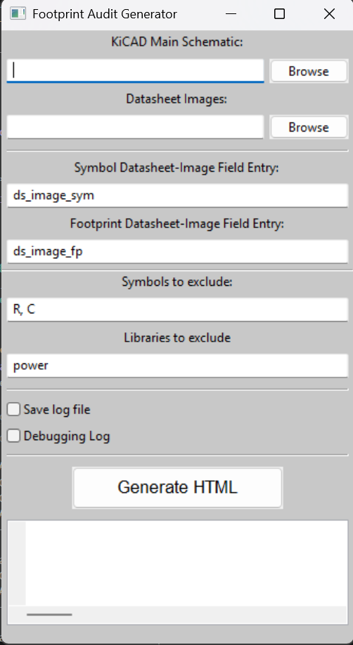
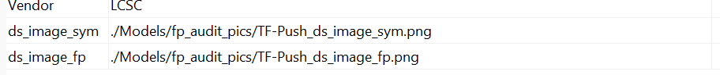
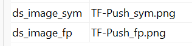
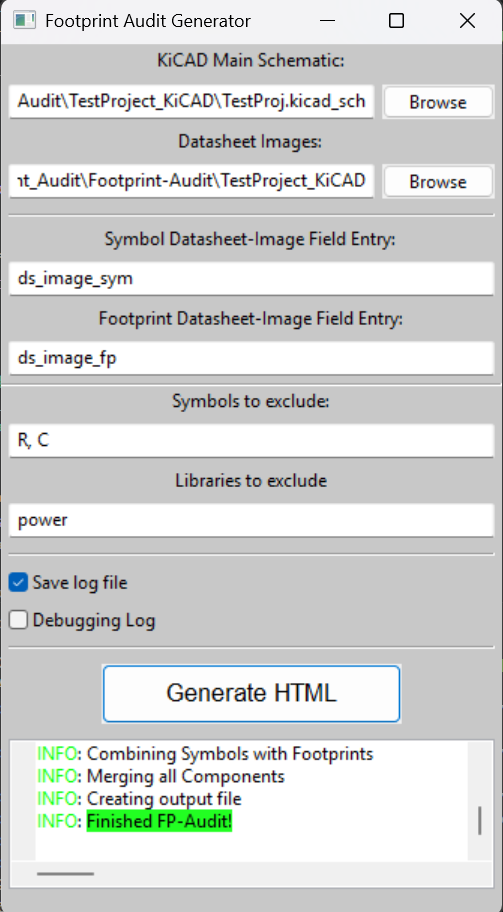
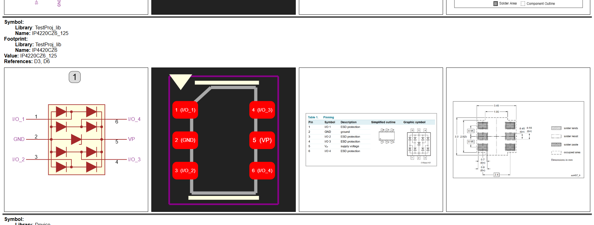
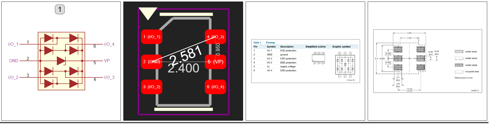
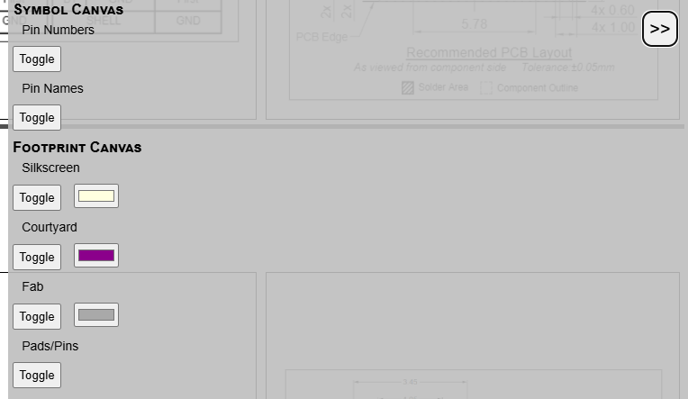

# KiCAD Footprint-Audit

An automatic KiCAD Footprint and Symbol Audit Creator

The plan for this project is to have a KiCAD Plugin that creates an interactive HTML file, that includes the footprint, symbol and pictures of the datasheet, for every component on the pcb, so they can be crosschecked, before sending the pcb to production. 
This should make it easier to audit the correctness of the used footprints, and make mistakes easier to spot. 
Necessary pictures from the datasheed need to be provided manually, and linked in the KiCAD symbol with specific fields.

This plugin is inspired by the [Interactive HTML BOM](https://github.com/openscopeproject/InteractiveHtmlBom/tree/master/InteractiveHtmlBom) plugin

## Code Base:

### TestProject_KiCAD

The TestProject_KiCAD folder is a basic KiCAD Project for debugging. 
> **Warning:** There are some mistakes done on purpose, to check the usefulness of the tool. 

In TestProject_KiCAD/FP_Audit, there is also the generated HTML file of this project (excluded R, C and the 'power' library)  

### Footprint_Audit

This is where the source code for the plugin lays. 

- *standalone_gui_start.py* is the main entry point for the gui.

- *gui_main.py* is the generated GUI using wxFormBuilder (Log Window is not generated but added in the gui_start, because wxFormBuilder does not support wxStyleTextCtrl for now).

- *footprint_audit.py* is the starting point for the KiCAD File Parser and HTML file generator. 
This can also be run by it's own, but the arguments are hardcoded for now at the end of the file (maybe adding a CLI interface with argparse in the future)

### pyInstaller_Build

I've prebuilt a one-file executable on Windows using pyInstaller. 

The command for this is as follows: 

<code>pyInstaller --onefile --noconsole --name Footprint-Audit --add-data  "../Footprint_Audit/web/fp_audit_style.css;web" --add-data  "../Footprint_Audit/web/fp_audit.js;web" --add-data  "../Footprint_Audit/web/fp_audit.html;web" --add-data  "../Footprint_Audit/web/Konva_min.js;web" ../Footprint_Audit/standalone_gui_start.py</code> 

It is important to use <code>--add-data</code>, because the executable will be launched inside a temp folder. The distinction between running footprint_audit.py as script or executable is also baked into generate_html.py to generate the correct path. 

If there are problems with the logging it can also be built without the argument: <code>--no-console</code>. 
This will start a seperate console window with the gui, where the program should print the logs into using a standard logging.StreamHandler().

On Linux the pyInstaller command should use <code>:</code> instead of <code>;</code>, but I've not tried it yet.  

> The Program does need some pip plugins like wx, sexp, pprint, ... that can be installed using <code>pip install xxx</code> 

## How to use

For now I've only implemented a standalone GUI. 

The usage is pretty straight-forward: 

  

### Main Schematic Path and Datasheet Images Folder
The first field is the path to the main schematic (named after the project itself), all hierarchical schematics will be parsed automatically. 
The second field, is the path to where the datasheet images are saved.
> **BE AWARE**: This path will be combined with the path of the field entries in the KiCAD symbol. 

If you'll look into the KiCAD symbols, you'll see these field entries:

>   

Because I used a relative path inside these two fields, the folder to select in the generator needs to be the Project Root folder! 

It could also be used like this: 

>  

In this case the folder selected should be 'Models/fp_audit_pics'  

### Field Entries

The third and fourth fields in the generator, are what the image fields are called, ds_image_sym and _fp are the standard setting, but can be changed 

### Excluding Symbols and Libraries

The two fields excluder settings are optional and lets you exclude certain symbols and libraries. 
I set the standard to exclude all Resistors and Capacitors (Symbols called R or C), and the whole 'power' library, as these power symbols do not have footprints anyway! 
All of those entries need to be comma-separated, whitespaces will be automatically stripped. 

### Logger Setting

Those two checkboxes are self-explanatory, *"Save log file"* creates a *fp_audit.log* file in the output directory (logging is configured to be appending!), and *"Debugging Log"* will log additional debug information into the saved log file (log file can get pretty large).

### HTML generation finished
The html generation is successfully finished if this is shown in the log window of the gui:

 

### Output file

The finished html file will be saved at /FP_Audit/fp_audit.html, inside the KiCAD Project folder. 

>  
All symbols, footprints and images can be moved with *mousepress + movement* and zoomed with pressing *Ctrl + Alt* and using the scrollwheel or touchpad. 
The little grey button on the top of the symbol canvas is used to switch between units in multi-unit symbols (e.g.: TestProjects STM32)

>  
The measurement function can be used with a doubleclick on the footprint canvas. It has a snap-in on rectangles, lines, and circles, to allow more accurate measurements to be made!

>  
On the upper-left corner there is a button to slide in the settings overlay. For now it can be used to toggle layers, and change the colors of the footprint canvas. 

Thanks for reading all that ^^ 

Feel free to look through the source, but be aware that this is my first bigger Python/JS project, therefore the code might be awful to look at :P (learned alot tho)

## What's next
If I've got the time, I would like to tidy up the python code a bit! 
The nested for-loops in the S-Expression Parsing is not that fine to look at.

After that interfacing the KiCAD API would be a good next big Milestone!
